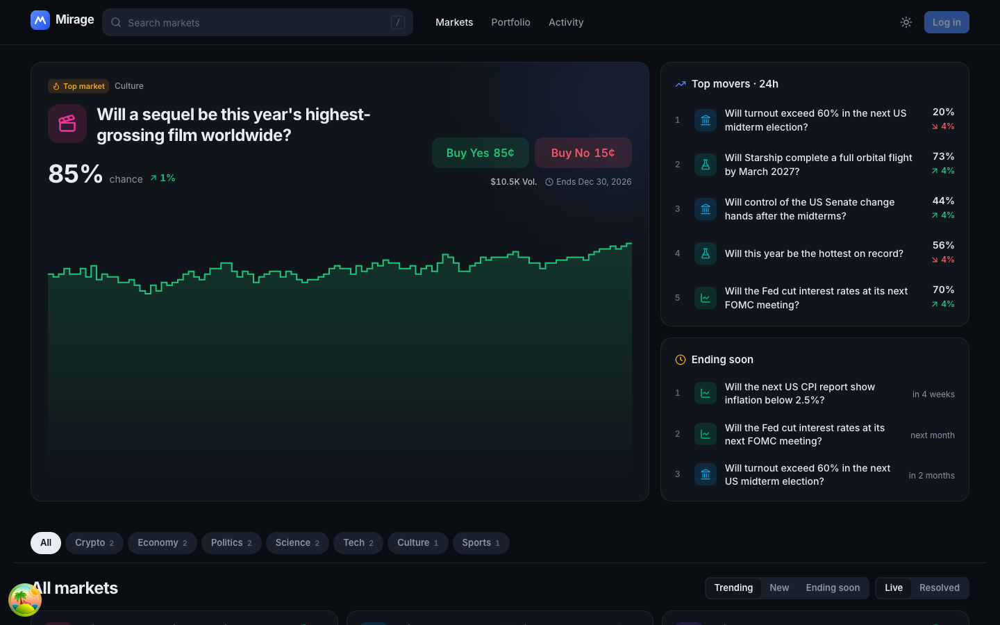
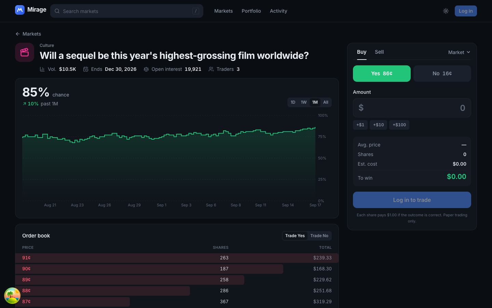
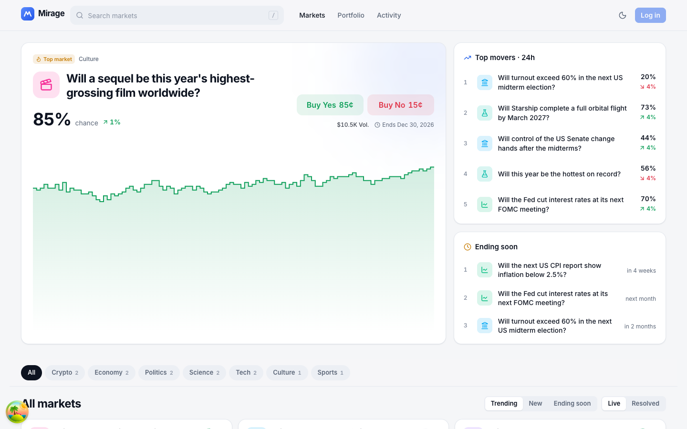
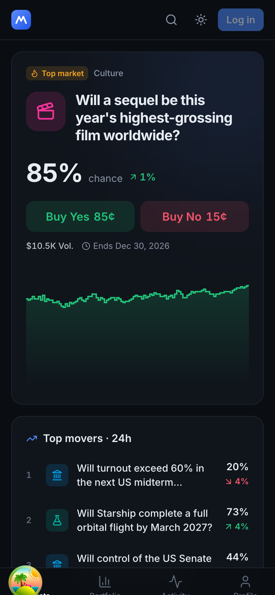
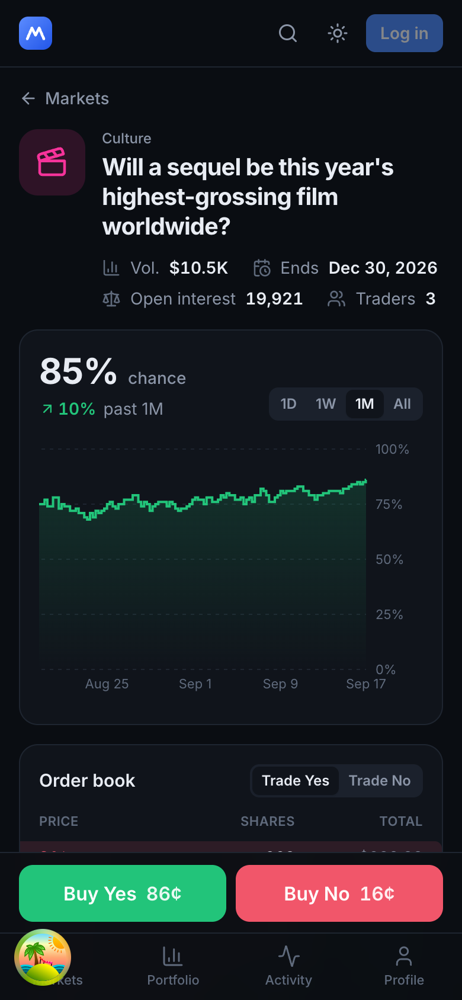
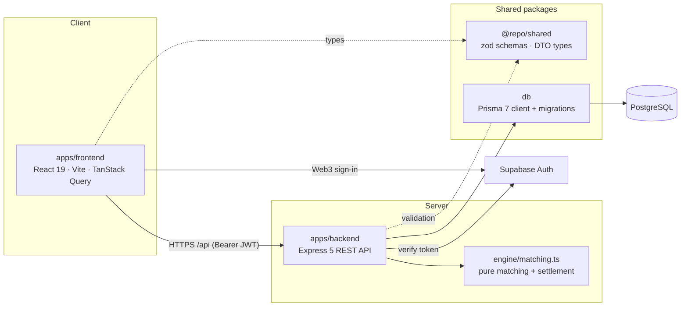

<div align="center">

# Mirage

**A full-stack prediction market with a real central limit order book.**

Trade Yes/No shares on real-world events, with price-time priority matching, escrowed balances, live order books, and price history. The whole stack is written in TypeScript.

[](https://github.com/Somilg11/mirage/actions/workflows/ci.yml)




</div>

> [!NOTE]
> Mirage is a **paper-trading** platform. Balances are simulated and have no monetary value.

---

## Table of contents

- [Features](#features)
- [Screenshots](#screenshots)
- [Architecture](#architecture)
- [How the order book works](#how-the-order-book-works)
- [Tech stack](#tech-stack)
- [Getting started](#getting-started)
- [Environment variables](#environment-variables)
- [Scripts](#scripts)
- [API reference](#api-reference)
- [Testing](#testing)
- [Deployment](#deployment)
- [Security](#security)
- [Project structure](#project-structure)
- [Roadmap](#roadmap)
- [Contributing](#contributing)
- [License](#license)

## Features

**Trading**

- A unified YES/NO central limit order book with **price-time priority** and self-trade prevention.
- **Market orders** (IOC) sized by dollar amount, and **limit orders** (GTC) that rest on the book.
- Crossing orders are settled in one of four ways: transfer, **mint** a YES+NO pair, **merge** a pair, or transfer NO.
- **Escrow**: buy orders lock cash and sell orders lock shares. Cancelling an order refunds the escrow immediately.
- **Split and merge**: turn $1 into 1 YES + 1 NO share, or merge a pair back into $1.
- **Resolution**: an admin resolves a market, open orders are refunded, and winning shares pay $1.00 each.

**Portfolio**

- Positions with average cost, current price, market value, and unrealized P&L.
- Open orders with fill progress and one-click cancel.
- A paginated activity ledger of every balance change: fills, rewards, splits, merges, and payouts.
- A daily $100 reward. The claim is enforced atomically in the database, once per UTC day.

**Experience**

- A market-grade UI with light and dark themes (the theme is applied before first paint, so there is no flash).
- Fully responsive layout: a bottom tab bar on mobile, a bottom-sheet trade ticket, and a sticky trade panel on desktop.
- Live data: the order book, trades, and prices poll in the background.
- Interactive price charts (1D / 1W / 1M / All) built from real trades, plus depth-shaded order book ladders.
- Search, category filters, and sorting (trending, new, ending soon). Filter state is stored in the URL.
- Sign in with a Solana wallet through Supabase Web3 auth.

## Screenshots

| Market page                         | Light theme                                  |
| ----------------------------------- | -------------------------------------------- |
|  |  |

| Mobile: markets                                         | Mobile: market detail                                     |
| ------------------------------------------------------- | --------------------------------------------------------- |
|  |  |

## Architecture



- **The contract is defined once.** `@repo/shared` holds the request schemas (zod) and response DTOs. The backend validates requests with the schemas, and the frontend imports the same types.
- **The engine is pure.** Matching and settlement math live in `engine/matching.ts` with no I/O, so they can be tested exhaustively.
- **Matching is serialized per market.** Each order placement runs in one database transaction holding a `FOR UPDATE` lock on the market row. Balance and share changes use conditional SQL (`WHERE balance >= cost`), so concurrent requests cannot overdraw an account.

## How the order book works

Every order is projected onto a single book quoted in **YES terms**:

| Order          | Book side | Book price |
| -------------- | --------- | ---------- |
| Buy YES @ _p_  | Bid       | _p_        |
| Sell NO @ _p_  | Bid       | 100 − _p_  |
| Sell YES @ _p_ | Ask       | _p_        |
| Buy NO @ _p_   | Ask       | 100 − _p_  |

A bid and an ask cross when `bid ≥ ask`. The trade executes at the **maker's price**, and the taker keeps any price improvement. Depending on which orders meet, a fill does one of the following:

| Bid \ Ask   | Sell YES                | Buy NO                      |
| ----------- | ----------------------- | --------------------------- |
| **Buy YES** | YES shares change hands | a new YES+NO pair is minted |
| **Sell NO** | a YES+NO pair is merged | NO shares change hands      |

A property-based test runs 5,000 random operations and asserts that
`Σ cash + Σ escrowed cash + 100 × outstanding pairs` never changes, and that YES and NO supply stay equal.

All money is stored as **integer cents**. Prices range from 1¢ to 99¢, and a winning share pays out 100¢.

## Tech stack

| Layer    | Technology                                                                                   |
| -------- | -------------------------------------------------------------------------------------------- |
| Frontend | React 19, Vite 8, React Router 7, TanStack Query 5, Tailwind CSS 4, Recharts, Sonner, Lucide |
| Backend  | Bun, Express 5, Zod 4, Pino, Helmet, express-rate-limit, Supabase JS                         |
| Data     | PostgreSQL, Prisma 7 (driver adapter `@prisma/adapter-pg`)                                   |
| Tooling  | Turborepo, TypeScript (strict), ESLint 9, Prettier, Vitest, Supertest, GitHub Actions        |

## Getting started

### Prerequisites

- [Bun](https://bun.sh) **1.3.10+**
- A PostgreSQL database: local Docker, [Neon](https://neon.tech), or [Supabase](https://supabase.com)
- A Supabase project with **Web3 (Solana) sign-in** enabled, for real authentication. This is optional for local development (see `AUTH_DEV_BYPASS`).

### 1. Install

```bash
git clone https://github.com/Somilg11/mirage.git
cd mirage
bun install
```

### 2. Configure environment

```bash
cp packages/db/.env.example    packages/db/.env
cp apps/backend/.env.example   apps/backend/.env
cp apps/frontend/.env.example  apps/frontend/.env
```

Fill in the values described in [Environment variables](#environment-variables).

### 3. Database

```bash
bun run db:up        # optional: start local Postgres via docker compose
bun run db:generate  # generate the Prisma client
bun run db:deploy    # apply migrations
bun run db:seed      # demo markets, price history and liquidity (idempotent)
```

### 4. Run

```bash
bun run dev
```

| App      | URL                                                   |
| -------- | ----------------------------------------------------- |
| Frontend | http://localhost:5173                                 |
| API      | http://localhost:3000/api (proxied by Vite at `/api`) |

> [!TIP]
> **No Supabase yet?** Set `AUTH_DEV_BYPASS=1` in `apps/backend/.env`. The API then authenticates requests from the `x-dev-address` header, which is useful for curl and integration tests. The server refuses to start with this flag when `NODE_ENV=production`.

## Environment variables

Each workspace owns its own `.env`. The committed `.env.example` files are the source of truth.

<details open>
<summary><code>packages/db/.env</code></summary>

| Variable            | Required | Description                                           |
| ------------------- | -------- | ----------------------------------------------------- |
| `DATABASE_URL`      | yes      | Postgres connection string used by Prisma and the API |
| `DATABASE_POOL_MAX` | no       | Max pooled connections (default 10)                   |

</details>

<details open>
<summary><code>apps/backend/.env</code></summary>

| Variable                 | Default                 | Description                                                   |
| ------------------------ | ----------------------- | ------------------------------------------------------------- |
| `NODE_ENV`               | `development`           | `development` \| `test` \| `production`                       |
| `PORT`                   | `3000`                  | HTTP port                                                     |
| `LOG_LEVEL`              | `info`                  | Pino log level                                                |
| `CORS_ORIGINS`           | `http://localhost:5173` | Comma-separated allowed origins                               |
| `TRUST_PROXY`            | `0`                     | Reverse-proxy hops to trust (for correct client IPs)          |
| `SUPABASE_URL`           | –                       | Required unless `AUTH_DEV_BYPASS=1`                           |
| `SUPABASE_SECRET_KEY`    | –                       | Service-role key. **Server only.**                            |
| `AUTH_DEV_BYPASS`        | `0`                     | Dev-only header auth. Rejected in production                  |
| `ADMIN_API_KEY`          | –                       | Enables `/api/admin/*` (min 32 chars: `openssl rand -hex 32`) |
| `STARTING_BALANCE_CENTS` | `1000`                  | Balance granted to new accounts                               |
| `DAILY_CLAIM_CENTS`      | `10000`                 | Daily reward amount                                           |
| `RATE_LIMIT_ENABLED`     | on (off in tests)       | Toggle rate limiting                                          |
| `DATABASE_URL`           | falls back to db `.env` | Override the database connection                              |

</details>

<details open>
<summary><code>apps/frontend/.env</code></summary>

| Variable                 | Default                 | Description                                         |
| ------------------------ | ----------------------- | --------------------------------------------------- |
| `VITE_API_URL`           | `/api`                  | API base URL. Set to the deployed API in production |
| `VITE_SUPABASE_URL`      | –                       | Supabase project URL                                |
| `VITE_SUPABASE_ANON_KEY` | –                       | Supabase public anon key                            |
| `DEV_API_PROXY_TARGET`   | `http://localhost:3000` | Where the Vite dev server proxies `/api`            |

</details>

The app stays fully browsable without the Supabase variables; only sign-in is disabled.

## Scripts

Run these from the repository root.

| Command               | Description                                                        |
| --------------------- | ------------------------------------------------------------------ |
| `bun run dev`         | Start the API and web app in watch mode (Turborepo)                |
| `bun run build`       | Production build of all workspaces                                 |
| `bun run lint`        | ESLint across the monorepo (zero warnings allowed)                 |
| `bun run check-types` | Strict TypeScript checks                                           |
| `bun run test`        | Unit tests, plus integration tests when `TEST_DATABASE_URL` is set |
| `bun run format`      | Format with Prettier (`format:check` in CI)                        |
| `bun run db:up`       | Start local Postgres with Docker Compose                           |
| `bun run db:generate` | Generate the Prisma client                                         |
| `bun run db:migrate`  | Create and apply a migration (development)                         |
| `bun run db:deploy`   | Apply pending migrations (CI and production)                       |
| `bun run db:seed`     | Seed demo data                                                     |
| `bun run db:studio`   | Open Prisma Studio                                                 |

## API reference

All routes are served under `/api`. Errors share one shape:

```json
{ "error": { "code": "INSUFFICIENT_BALANCE", "message": "Not enough balance", "details": {} } }
```

| Method | Path                                 | Auth          | Description                                      |
| ------ | ------------------------------------ | ------------- | ------------------------------------------------ |
| GET    | `/health`                            | –             | Liveness check plus a database ping              |
| GET    | `/markets?category&status&sort&q`    | –             | Market list with prices, 24h change, volume      |
| GET    | `/markets/categories`                | –             | Categories with open-market counts               |
| GET    | `/markets/:idOrSlug`                 | –             | Market detail, rules, open interest, traders     |
| GET    | `/markets/:idOrSlug/orderbook`       | –             | Aggregated YES and NO ladders                    |
| GET    | `/markets/:idOrSlug/trades?limit`    | –             | Recent trades                                    |
| GET    | `/markets/:idOrSlug/prices?interval` | –             | Bucketed price history (`1d`, `1w`, `1m`, `all`) |
| POST   | `/markets/:idOrSlug/split`           | user          | Mint YES+NO pairs from cash                      |
| POST   | `/markets/:idOrSlug/merge`           | user          | Redeem YES+NO pairs for cash                     |
| GET    | `/me`                                | user          | Account, balances, next claim time               |
| POST   | `/me/claim`                          | user          | Claim the daily reward                           |
| GET    | `/portfolio`                         | user          | Cash, positions, value, P&L                      |
| GET    | `/orders?status&marketId`            | user          | Order history                                    |
| POST   | `/orders`                            | user          | Place an order                                   |
| DELETE | `/orders/:id`                        | user          | Cancel an open order                             |
| GET    | `/activity?limit&cursor`             | user          | Cursor-paginated ledger                          |
| POST   | `/admin/markets`                     | `x-admin-key` | Create a market                                  |
| POST   | `/admin/markets/:idOrSlug/resolve`   | `x-admin-key` | Resolve a market and pay out winners             |

User routes expect `Authorization: Bearer <supabase access token>`.

<details>
<summary>Example: place an order</summary>

```bash
curl -X POST http://localhost:3000/api/orders \
  -H "Authorization: Bearer $TOKEN" \
  -H "Content-Type: application/json" \
  -d '{ "marketId": "bitcoin-above-150k", "outcome": "yes", "side": "buy", "price": 48, "quantity": 100, "timeInForce": "GTC" }'
```

```jsonc
// 201 Created
{
  "order": { "id": "…", "status": "open", "price": 48, "quantity": 100, "filledQuantity": 40, "…": "…" },
  "fills": [{ "price": 47, "quantity": 40 }],
  "averagePrice": 47,
}
```

</details>

<details>
<summary>Example: create and resolve a market</summary>

```bash
curl -X POST http://localhost:3000/api/admin/markets \
  -H "x-admin-key: $ADMIN_API_KEY" -H "Content-Type: application/json" \
  -d '{ "title": "Will it rain in London tomorrow?", "description": "…", "rules": "Resolves YES if …",
        "category": "Science", "endDate": "2026-12-31T00:00:00Z" }'

curl -X POST http://localhost:3000/api/admin/markets/<slug>/resolve \
  -H "x-admin-key: $ADMIN_API_KEY" -H "Content-Type: application/json" \
  -d '{ "outcome": "yes" }'
```

</details>

## Testing

```bash
bun run test                                                    # engine unit tests
TEST_DATABASE_URL=postgresql://…/mirage_test bun run test       # plus HTTP integration tests
```

- **Unit tests** (`apps/backend/tests/matching.test.ts`) cover all four settlement paths, price-time priority, partial fills, self-trade prevention, and a 5,000-step conservation property test.
- **Integration tests** (`apps/backend/tests/api.test.ts`) exercise the real HTTP API against Postgres: escrow and refunds, IOC fills with no liquidity, insufficient funds, split and merge, the double-claim guard, admin resolution payouts, validation, and pagination. Set `TEST_CONCURRENCY=1` to also run the concurrent-claim race test.

> [!WARNING]
> Integration tests write to the database. Point `TEST_DATABASE_URL` at a **disposable** database. The tests never fall back to `DATABASE_URL`.

CI (`.github/workflows/ci.yml`) runs formatting, lint, typecheck, migrations, the full test suite against a Postgres service, and a production build on every push and pull request.

## Deployment

**API** (any Bun or container host: Fly.io, Railway, Render, ECS):

```bash
bun install --frozen-lockfile
bun run db:generate && bun run db:deploy
NODE_ENV=production bun apps/backend/src/index.ts
```

Set `CORS_ORIGINS` to your web origin, set `TRUST_PROXY=1` behind a load balancer, and provide `SUPABASE_*` and `ADMIN_API_KEY`. The process shuts down gracefully on `SIGTERM`.

**Web app** (static; Vercel, Netlify, Cloudflare Pages):

```bash
VITE_API_URL=https://api.example.com/api bun run build --filter=frontend
# output: apps/frontend/dist
```

`apps/frontend/vercel.json` configures SPA rewrites and immutable caching for hashed assets.

## Security

- **Authentication**: the API verifies Supabase JWTs server-side. The wallet address comes from verified token claims, never from the client.
- **Validation**: every request body and query is parsed with a strict zod schema. Prices are bounded to 1–99¢ and quantities to 1–100,000.
- **Integrity**: balance and share debits are conditional SQL updates inside transactions, and per-market row locks serialize matching.
- **Hardening**: Helmet security headers, a CORS allowlist, a 100 KB body limit, per-IP and per-user rate limits (orders: 30/min), request IDs, and no stack traces in 5xx responses.
- **Admin**: admin routes compare the key in constant time, and return 404 when no key is configured.
- **Secrets**: `.env` files are git-ignored, and only the Supabase **anon** key reaches the browser.

To report a vulnerability, email **security@mirage.com** rather than opening a public issue.

## Project structure

```
.
├── apps/
│   ├── backend/                 # Express 5 API (Bun)
│   │   ├── src/
│   │   │   ├── config/          # validated environment
│   │   │   ├── engine/          # pure matching & settlement
│   │   │   ├── middleware/      # auth, admin, rate limit, errors
│   │   │   ├── routes/          # HTTP handlers
│   │   │   ├── services/        # database use cases
│   │   │   ├── app.ts           # app factory
│   │   │   └── index.ts         # bootstrap + graceful shutdown
│   │   ├── scripts/seed.ts      # demo data
│   │   └── tests/               # unit + integration
│   └── frontend/                # React 19 SPA (Vite)
│       └── src/
│           ├── api/             # axios client + typed endpoints
│           ├── app/             # providers + router
│           ├── components/      # ui primitives, layout, market, portfolio
│           ├── hooks/           # TanStack Query hooks
│           ├── lib/             # formatting, market math, env
│           ├── pages/           # route screens (code-split)
│           └── providers/       # auth + theme context
├── packages/
│   ├── db/                      # Prisma schema, migrations, client
│   ├── shared/                  # zod schemas + API DTO types
│   ├── eslint-config/           # shared ESLint config
│   └── typescript-config/       # shared tsconfig bases
├── .github/                     # CI + Dependabot
├── docker-compose.yml           # local Postgres
└── turbo.json
```

## Roadmap

- [ ] WebSocket or SSE streaming for the order book and trades (replacing polling)
- [ ] Multi-outcome (categorical) markets
- [ ] An admin dashboard UI for market creation and resolution
- [ ] Leaderboards and public trader profiles
- [ ] Playwright end-to-end tests
- [ ] OpenAPI spec generated from the zod schemas

## Contributing

1. Create a branch: `git checkout -b feat/short-description`
2. Make changes, then run `bun run format && bun run lint && bun run check-types && bun run test`
3. Commit using [Conventional Commits](https://www.conventionalcommits.org) (`feat:`, `fix:`, `chore:` …)
4. Open a pull request. CI must pass before merge.

When the database schema changes, run `bun run db:migrate` and commit the generated migration.

## License

Copyright © 2026 Somil Gupta. All rights reserved. This project is proprietary; no license is granted to use, copy, or distribute it without permission.
