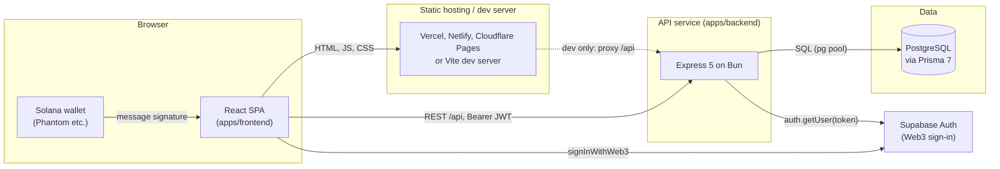
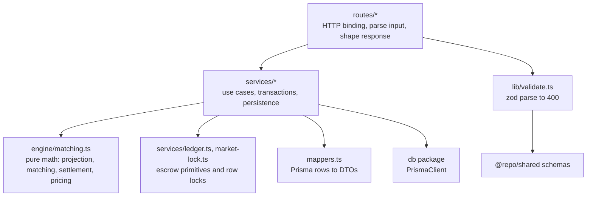
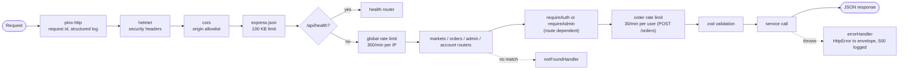
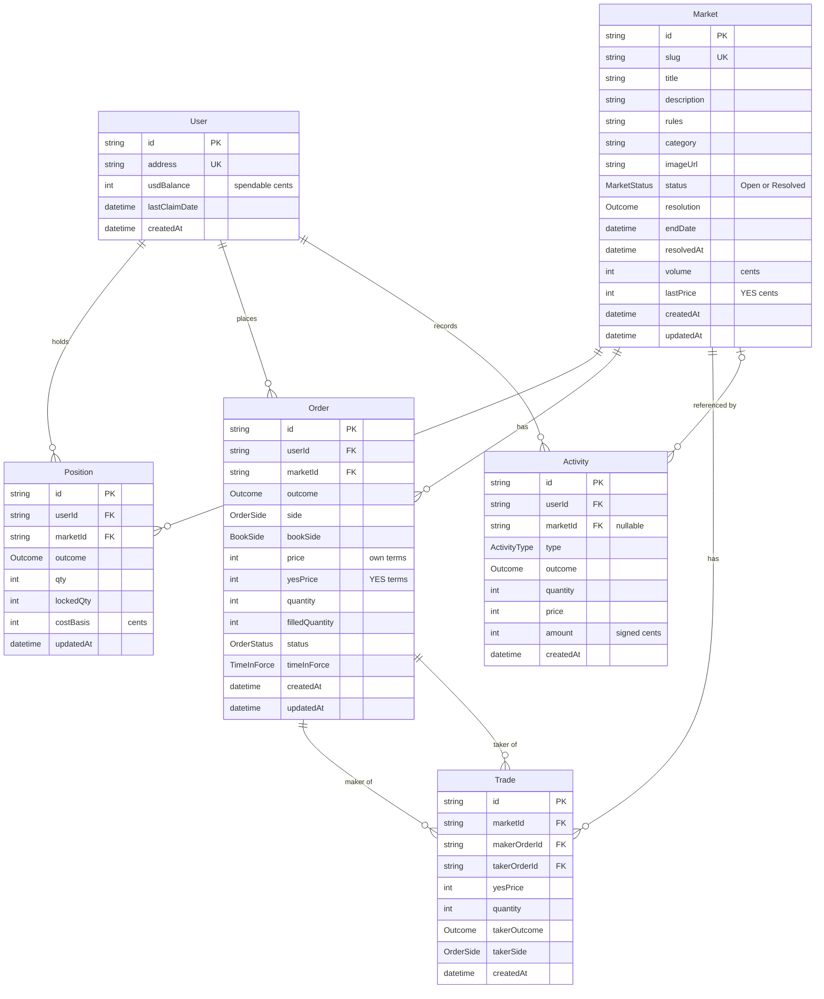
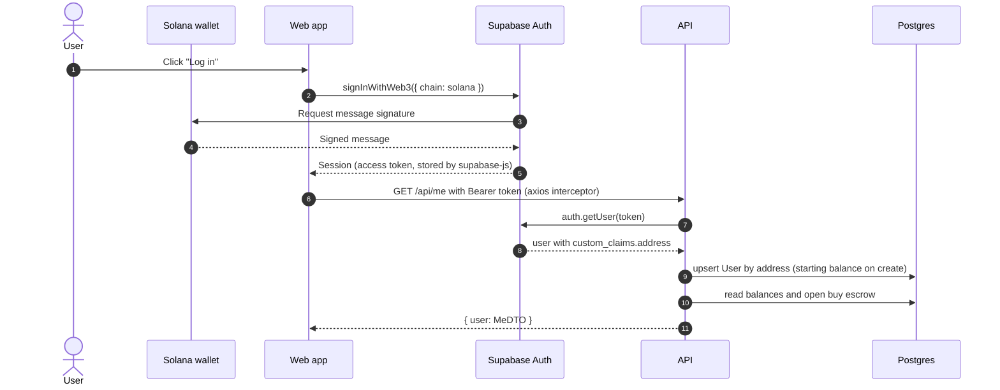
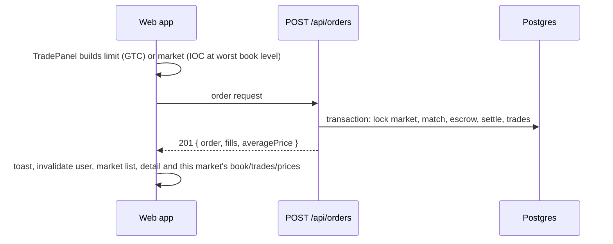
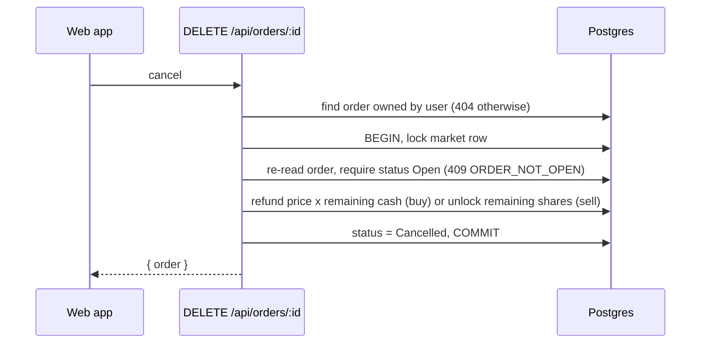
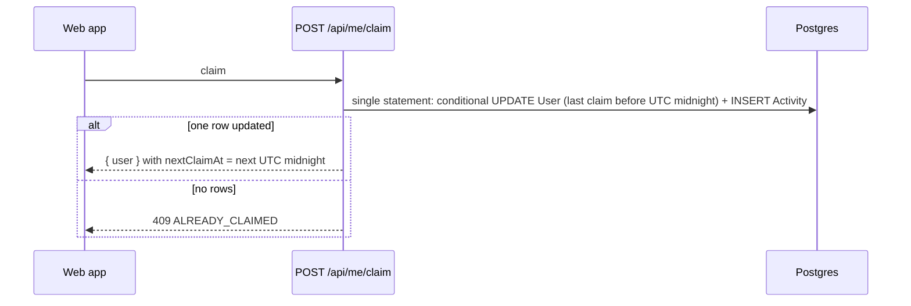
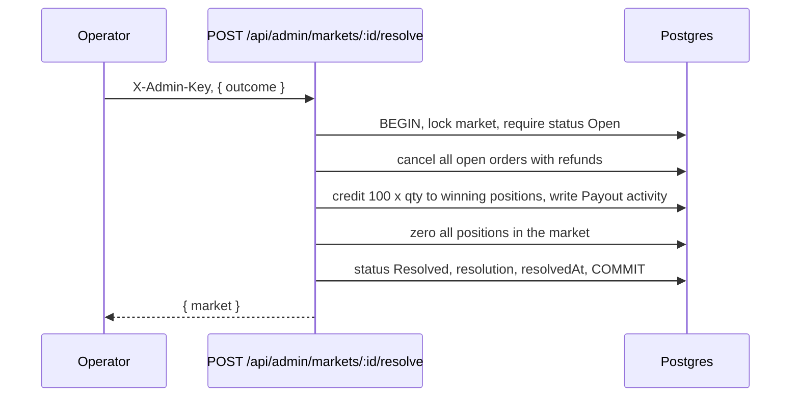
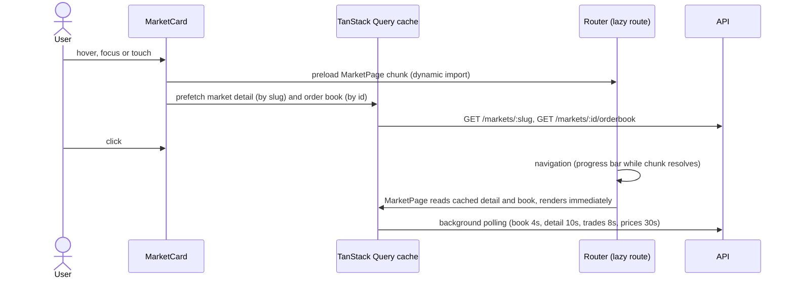

# Architecture

How Mirage is structured, how requests flow through it, and how it is built, tested and deployed.

Related documents: [Core exchange logic](./core.md) · [API reference](./api.md) · [Roadmap](./plan.md)

---

## 1. System overview

Mirage is a paper-trading prediction market. Users sign in with a Solana wallet, receive simulated cash, and trade YES/NO shares on a central limit order book. It is a TypeScript monorepo with a React single-page app, an Express API and a PostgreSQL database.



## 2. Monorepo layout

Managed with Bun workspaces and Turborepo.

| Workspace                    | Package name              | Responsibility                                                                |
| ---------------------------- | ------------------------- | ----------------------------------------------------------------------------- |
| `apps/backend`               | `backend`                 | REST API, matching engine, settlement, auth, admin, seed script, tests        |
| `apps/frontend`              | `frontend`                | React SPA: market browsing, trading UI, portfolio, activity, profile          |
| `packages/shared`            | `@repo/shared`            | Zod request schemas, response DTO types, exchange constants (single contract) |
| `packages/db`                | `db`                      | Prisma schema, migrations, generated client, shared `PrismaClient` singleton  |
| `packages/eslint-config`     | `@repo/eslint-config`     | Shared ESLint base config (backend)                                           |
| `packages/typescript-config` | `@repo/typescript-config` | Shared `tsconfig` bases                                                       |

Other top-level files: `turbo.json` (task graph), `docker-compose.yml` (local Postgres), `.github/workflows/ci.yml`, `.github/dependabot.yml`, `.prettierrc.json`, `.editorconfig`.

## 3. Tech stack

| Layer   | Technology                                                                                                                                     |
| ------- | ---------------------------------------------------------------------------------------------------------------------------------------------- |
| Runtime | Bun 1.3 (API, scripts, package manager), Node-compatible tooling                                                                               |
| API     | Express 5, Zod 4, Helmet, cors, express-rate-limit, Pino + pino-http, @supabase/supabase-js                                                    |
| Data    | PostgreSQL, Prisma 7 with the `@prisma/adapter-pg` driver adapter                                                                              |
| Web     | React 19, Vite 8, React Router 7 (data router), TanStack Query 5, Tailwind CSS 4, Radix-based shadcn/ui components, Recharts 3, Sonner, Lucide |
| Tooling | Turborepo 2, TypeScript (strict), ESLint, Prettier, Vitest 4, Supertest, GitHub Actions                                                        |

## 4. Backend architecture

### 4.1 Layering



| Directory           | Contents                                                                                                                            |
| ------------------- | ----------------------------------------------------------------------------------------------------------------------------------- |
| `src/index.ts`      | Process bootstrap: env validation, `listen`, graceful shutdown on `SIGTERM`/`SIGINT` (10 s force exit), unhandled rejection logging |
| `src/app.ts`        | `createApp()` factory used by the server and integration tests                                                                      |
| `src/config/env.ts` | Zod-validated environment; blank values are treated as unset; fails fast with a readable list of problems                           |
| `src/routes/`       | `health`, `markets`, `account` (me, claim, portfolio, activity), `orders`, `admin`                                                  |
| `src/services/`     | `orders`, `markets`, `positions`, `users`, `activity`, `admin`, `ledger`, `market-lock`                                             |
| `src/engine/`       | `matching.ts` – no I/O, fully unit tested                                                                                           |
| `src/middleware/`   | `auth` (Supabase / dev bypass), `admin` (key check), `rate-limit`, `error` (404 + error envelope)                                   |
| `src/lib/`          | `errors` (`HttpError` helpers), `validate`, `logger`, `time`                                                                        |
| `scripts/seed.ts`   | Idempotent demo data: markets, backdated history, liquidity placed through the real order service                                   |

### 4.2 Request pipeline



Express 5 forwards rejected promises from async handlers to the error handler, so services simply throw `HttpError`s.

### 4.3 Data model



Key indexes: `Order(marketId, status, bookSide, yesPrice, createdAt)` for matching and book aggregation; `Order(userId, status, createdAt)` for order history; `Trade(marketId, createdAt)` for tape and price history; `Activity(userId, createdAt)` for the ledger; `Position(userId, marketId, outcome)` unique; `Market(status, endDate)` and `Market(category)` for listing.

Migrations live in `packages/db/prisma/migrations`. The `20260916000000_clob_rewrite` migration converted the earlier JSON-order-book schema in place: it renamed `OrderHistory` to `Activity` (backfilling signed amounts), added market metadata (slug from id, end date 90 days out), added escrow columns to `Position`, and created `Order` and `Trade`, preserving existing rows.

## 5. Key flows

### 5.1 Sign-in and first authenticated request



### 5.2 Place order

Detailed step-by-step sequence with locking and settlement: [core.md §8](./core.md#8-order-placement-sequence).



### 5.3 Cancel order



### 5.4 Daily claim



### 5.5 Market resolution



### 5.6 Page load with prefetch



## 6. Frontend architecture

### 6.1 Composition

```text
main.tsx
└─ App
   ├─ ErrorBoundary (AppCrashScreen)          last-resort crash screen
   └─ ThemeProvider                           data-theme on <html>, persisted choice
      └─ QueryClientProvider                  staleTime 5s, no retry on 4xx, 2 retries otherwise
         └─ AuthProvider                      Supabase session, status, signIn/signOut
            └─ TooltipProvider                Radix tooltips
               ├─ RouterProvider
               │  └─ AppShell                 header, category nav, footer, mobile tab bar
               │     ├─ NavigationProgress    top bar while lazy routes load
               │     ├─ ScrollRestoration     keyed by pathname
               │     └─ ErrorBoundary         resets on path change (RouteErrorFallback)
               │        └─ <Outlet/>          pages (opacity-only enter animation)
               └─ Toaster (Sonner)
```

| Folder                      | Contents                                                                                                                                          |
| --------------------------- | ------------------------------------------------------------------------------------------------------------------------------------------------- |
| `src/app/`                  | `App`, `router`, route `preload` helpers                                                                                                          |
| `src/api/`                  | axios `http` client (auth header, `ApiError` normalization), typed `endpoints`                                                                    |
| `src/hooks/`                | `queries.ts` (all TanStack Query hooks and keys), `useMediaQuery`, `useDocumentTitle`, `useThemeColors`, `useDebouncedValue`                      |
| `src/providers/`            | `AuthProvider`, `ThemeProvider`                                                                                                                   |
| `src/components/layout/`    | `AppShell`, `Header` (search, section nav), `MobileTabBar`, `Footer`, auth controls, fallbacks                                                    |
| `src/components/market/`    | cards and table, featured market, ticker, price chart, order book, trade panel, stats, position                                                   |
| `src/components/portfolio/` | order table/rows, sign-in gate                                                                                                                    |
| `src/components/ui/`        | primitives (`Card`, `Badge`, `Tabs`, `SegmentedControl`, …), `Button`, `Sheet`, `LoadMore`, shadcn `dialog`, `dropdown-menu`, `select`, `tooltip` |
| `src/components/errors/`    | `ErrorBoundary`, `SectionBoundary` (widget-level, resets failed queries), `AppCrashScreen`                                                        |
| `src/lib/`                  | formatting, market math (book walking for market orders), env, Supabase client, `cn`                                                              |
| `src/pages/`                | Home, Market, Portfolio, Activity, Profile, legal pages, 404                                                                                      |

### 6.2 Routing

`createBrowserRouter` (data router). The home page is bundled eagerly; every other page uses the route `lazy` API so navigation stays on the current page while the chunk loads.

| Path                             | Page / behaviour                                                                                                                    |
| -------------------------------- | ----------------------------------------------------------------------------------------------------------------------------------- |
| `/`                              | Home: ticker, overview stats, featured market, movers, paginated grid/table. Query params `q`, `category`, `sort`, `status`, `view` |
| `/markets/:slug`                 | Market detail and trading (lazy)                                                                                                    |
| `/portfolio`                     | Positions, open orders, history via `?tab=` (lazy)                                                                                  |
| `/activity`                      | Ledger with type filter (lazy)                                                                                                      |
| `/profile`                       | Account, daily reward, preferences (lazy)                                                                                           |
| `/terms`, `/privacy`, `/contact` | Legal pages (lazy)                                                                                                                  |
| `/market/:id`                    | Redirect to `/markets/:id` (legacy links)                                                                                           |
| `/orders`                        | Redirect to `/portfolio?tab=orders`                                                                                                 |
| `/policies`                      | Redirect to `/privacy`                                                                                                              |
| `*`                              | `NotFoundPage` with trending suggestions                                                                                            |

Error handling layers: route `errorElement` (`RouteErrorPage`, which detects stale chunk errors after deploys and 404 route responses), the shell-level `ErrorBoundary`, per-widget `SectionBoundary` (chart, stats, position, featured market), and the app-level crash screen. A missing market renders the shared `NotFoundState`. `hydrateFallbackElement` shows a logo while a deep-linked lazy route resolves on first load. Each page sets `document.title` via `useDocumentTitle`.

### 6.3 Server state

All server data goes through TanStack Query hooks in `src/hooks/queries.ts`.

| Key                                       | Hook                                                        | Refresh                 |
| ----------------------------------------- | ----------------------------------------------------------- | ----------------------- |
| `['markets','list',params]`               | `useMarkets` (first page, limit 50)                         | 30 s poll               |
| `['markets','list','infinite',params]`    | `useInfiniteMarkets` (24 per page)                          | 30 s poll               |
| `['markets','categories']`                | `useCategories`                                             | stale after 60 s        |
| `['markets','detail',slug]`               | `useMarket`                                                 | 10 s poll               |
| `['markets','orderbook',id]`              | `useOrderBook`                                              | 4 s poll                |
| `['markets','trades',id]`, `…,'infinite'` | `useTrades`, `useInfiniteTrades`                            | 8 s poll                |
| `['markets','prices',id,interval]`        | `usePriceHistory`                                           | 30 s poll               |
| `['user',userId,'me']`                    | `useMe`                                                     | 30 s poll               |
| `['user',userId,'portfolio']`             | `usePortfolio`                                              | 15 s poll               |
| `['user',userId,'orders',params]`         | `useOrders` (limit 100) / `useInfiniteOrders` (25 per page) | 10 s / 15 s             |
| `['user',userId,'activity']`              | `useActivity` (30 per page)                                 | on focus / invalidation |

- **Invalidation**: every trading mutation (place, cancel, claim, split, merge) invalidates all `['user']` keys, every `['markets', …]` key that contains the affected market id, and all market lists and details.
- **Sign-out** removes all `['user']` queries.
- **Placeholder data** (`keepPreviousData`) keeps lists and charts stable while filters change.
- **Prefetch**: market cards and table rows prefetch detail, order book and the route chunk on hover, focus or touch.
- **Pagination**: infinite queries follow `nextCursor`; the `LoadMore` footer auto-loads when scrolled into view (market grid, activity) or on click (order history, trade tape).
- **Rendering**: market cards and rows are memoized; card lists use `content-visibility: auto`; route chunks and vendor chunks (`react`, `charts`, `supabase`) are split.

### 6.4 Theming and design system

- Design tokens are CSS custom properties on `:root`/`[data-theme='light']` and `[data-theme='dark']` in `src/index.css` (`--bg`, `--surface`, `--surface-2/3`, `--border`, `--fg`, `--fg-muted`, `--fg-subtle`, `--primary`, `--yes`, `--no`, `--warn` and soft variants). They are exposed to Tailwind through `@theme inline` (`bg-surface`, `text-yes`, …) and aliased to shadcn names (`--color-popover`, `--color-accent`, `--color-muted-foreground`, …).
- `public/theme-init.js` runs before first paint to apply the stored or system theme without a flash; `ThemeProvider` keeps it in sync and persists the choice in `localStorage`.
- Custom utilities: `label-mono` (mono uppercase micro-labels), `bg-grid` (masked grid texture), `num` (tabular numerals), `no-scrollbar`, `pb-safe`, ticker and page-transition animations. `prefers-reduced-motion` disables animation.
- Fonts are self-hosted via Fontsource (Inter Variable, JetBrains Mono Variable).
- shadcn/ui (new-york style, `components.json`) provides Radix-based `DropdownMenu`, `Select`, `Tooltip` and `Dialog`; the rest are local primitives.
- Charts read resolved token colors through `useThemeColors`, because SVG presentation attributes cannot consume CSS variables.

### 6.5 Responsive strategy

| Breakpoint          | Behaviour                                                                                                      |
| ------------------- | -------------------------------------------------------------------------------------------------------------- |
| `< md` (phones)     | Bottom tab bar, collapsible search, horizontally scrolling section nav, single-column cards, compact list rows |
| `md`–`lg` (tablets) | Header search visible, two-column grids, mobile trading bar and bottom-sheet ticket                            |
| `≥ lg` (desktop)    | Primary nav, portfolio/cash summary in header, sticky trade ticket beside the market, full data tables         |

The trade ticket switches between an in-page sticky card and a bottom `Sheet` at the `lg` breakpoint (`useMediaQuery`). Layouts were audited for horizontal overflow at 320, 360, 390, 430, 768, 1024 and 1440 px.

### 6.6 Security headers (static hosting)

Defined once in `src/security-headers.json`, and duplicated in `vercel.json` and `public/_headers` (Netlify/Cloudflare). `vite preview` applies them so issues surface before deploy.

| Header                       | Value                                                                                                                                                                                                                                                                          |
| ---------------------------- | ------------------------------------------------------------------------------------------------------------------------------------------------------------------------------------------------------------------------------------------------------------------------------ |
| `Content-Security-Policy`    | `default-src 'self'; script-src 'self'; style-src 'self' 'unsafe-inline'; img-src 'self' data: blob: https:; font-src 'self' data:; connect-src 'self' https: wss:; object-src 'none'; base-uri 'self'; form-action 'self'; frame-ancestors 'none'; upgrade-insecure-requests` |
| `Strict-Transport-Security`  | `max-age=63072000; includeSubDomains; preload`                                                                                                                                                                                                                                 |
| `X-Content-Type-Options`     | `nosniff`                                                                                                                                                                                                                                                                      |
| `X-Frame-Options`            | `DENY`                                                                                                                                                                                                                                                                         |
| `Referrer-Policy`            | `strict-origin-when-cross-origin`                                                                                                                                                                                                                                              |
| `Permissions-Policy`         | camera, microphone, geolocation, payment, usb and interest-cohort disabled                                                                                                                                                                                                     |
| `Cross-Origin-Opener-Policy` | `same-origin-allow-popups` (wallet popups)                                                                                                                                                                                                                                     |

No inline scripts are used, which is what allows `script-src 'self'`. SPA fallback: `vercel.json` rewrites and `public/_redirects`. Hashed assets are cached immutably; `index.html` is `no-cache`.

## 7. Configuration

### 7.1 `apps/backend/.env`

| Variable                 | Default                   | Purpose                                                        |
| ------------------------ | ------------------------- | -------------------------------------------------------------- |
| `NODE_ENV`               | `development`             | `development` \| `test` \| `production`                        |
| `PORT`                   | `3000`                    | HTTP port                                                      |
| `LOG_LEVEL`              | `info` (`silent` in test) | Pino level; pretty output in development                       |
| `CORS_ORIGINS`           | `http://localhost:5173`   | Comma-separated allowlist or `*`                               |
| `TRUST_PROXY`            | `0`                       | Proxy hops trusted for client IP                               |
| `SUPABASE_URL`           | –                         | `https://<ref>.supabase.co`; required unless dev bypass        |
| `SUPABASE_SECRET_KEY`    | –                         | Service key for token verification; required unless dev bypass |
| `AUTH_DEV_BYPASS`        | `0`                       | Header-based auth for local use; rejected in production        |
| `ADMIN_API_KEY`          | –                         | Enables admin routes (≥32 chars)                               |
| `STARTING_BALANCE_CENTS` | `1000`                    | Cash for new users                                             |
| `DAILY_CLAIM_CENTS`      | `10000`                   | Daily reward                                                   |
| `RATE_LIMIT_ENABLED`     | on outside test           | Toggle rate limiting                                           |
| `DATABASE_URL`           | from `packages/db/.env`   | Optional override                                              |

### 7.2 `packages/db/.env`

| Variable            | Purpose                                                                                        |
| ------------------- | ---------------------------------------------------------------------------------------------- |
| `DATABASE_URL`      | Postgres connection for the Prisma CLI and runtime (loaded as a fallback; host app values win) |
| `DATABASE_POOL_MAX` | Optional `pg` pool size                                                                        |

### 7.3 `apps/frontend/.env`

| Variable                 | Default                 | Purpose                                              |
| ------------------------ | ----------------------- | ---------------------------------------------------- |
| `VITE_API_URL`           | `/api`                  | API base URL baked into the build                    |
| `VITE_SUPABASE_URL`      | –                       | Supabase project URL (sign-in disabled when missing) |
| `VITE_SUPABASE_ANON_KEY` | –                       | Public anon key                                      |
| `DEV_API_PROXY_TARGET`   | `http://localhost:3000` | Dev server `/api` proxy target                       |

### 7.4 Tests

| Variable            | Purpose                                                                                      |
| ------------------- | -------------------------------------------------------------------------------------------- |
| `TEST_DATABASE_URL` | Enables integration tests against a disposable database (never falls back to `DATABASE_URL`) |
| `TEST_CONCURRENCY`  | `1` enables the concurrent daily-claim test                                                  |

## 8. Build, CI and deployment

### 8.1 Turborepo pipeline

| Task          | Depends on                     | Notes                                                |
| ------------- | ------------------------------ | ---------------------------------------------------- |
| `db:generate` | –                              | Uncached; outputs `generated/**`                     |
| `build`       | `^build`, `^db:generate`       | Outputs `dist/**`; `VITE_*` affects cache key        |
| `check-types` | `^check-types`, `^db:generate` |                                                      |
| `lint`        | `^db:generate`                 |                                                      |
| `test`        | `^db:generate`                 | `TEST_DATABASE_URL`, `TEST_CONCURRENCY` in cache key |
| `dev`         | `^db:generate`                 | Persistent, uncached                                 |

Root scripts wrap these (`bun run dev|build|lint|check-types|test`) plus `format`, `format:check`, `db:up`, `db:generate`, `db:migrate`, `db:deploy`, `db:seed`, `db:studio`.

### 8.2 Continuous integration

`.github/workflows/ci.yml` runs on pushes to `main` and on pull requests (cancelling superseded runs):

1. Start a `postgres:17-alpine` service.
2. `bun install --frozen-lockfile`
3. `bun run db:generate`
4. `bun run db:deploy` (migrations against the CI database)
5. `bun run format:check`
6. `bun run lint`
7. `bun run check-types`
8. `bun run test` with `TEST_DATABASE_URL` and `TEST_CONCURRENCY=1`
9. `bun run build`

Dependabot opens weekly npm and monthly GitHub Actions update PRs.

### 8.3 Deployment

- **Web app**: static build (`VITE_API_URL=https://api.example.com/api bun run build --filter=frontend`) deployed to Vercel (`apps/frontend/vercel.json`) or any static host (`public/_headers`, `public/_redirects`).
- **API**: any Bun-capable host or container. Run `bun run db:generate && bun run db:deploy`, then `NODE_ENV=production bun apps/backend/src/index.ts`. Set `CORS_ORIGINS`, `TRUST_PROXY`, `SUPABASE_*`, `ADMIN_API_KEY`. The process drains connections on `SIGTERM`.
- **Database**: managed Postgres (Neon, Supabase) or `docker compose up -d postgres` locally. Lower `DATABASE_POOL_MAX` on small plans.
- **Seed**: `bun run db:seed` refuses to run with `NODE_ENV=production` unless `--force` is passed.

## 9. Testing strategy

| Layer             | Location                              | What it covers                                                                                                                                                      |
| ----------------- | ------------------------------------- | ------------------------------------------------------------------------------------------------------------------------------------------------------------------- |
| Engine unit tests | `apps/backend/tests/matching.test.ts` | Projection, all four fill types, priority, self-trade skip, settlement helpers, pricing, randomized conservation property (5,000 steps)                             |
| API integration   | `apps/backend/tests/api.test.ts`      | Real HTTP (`supertest` on `createApp`) against Postgres: escrow, cancels, IOC, balances, split/merge, claims, resolution, validation, listing and cursor pagination |
| Static analysis   | all workspaces                        | Strict TypeScript, ESLint (`--max-warnings 0`), Prettier check                                                                                                      |

Integration tests run sequentially (`fileParallelism: false`) and use unique per-run addresses and market titles, so they can share one disposable database.

## 10. Observability and security

- **Logging**: Pino JSON logs with request id (`X-Request-Id` honoured or generated), status-based log level, secrets redacted, health checks excluded. Unhandled errors are logged server-side and returned as `500 INTERNAL` without internals.
- **Health**: `GET /api/health` probes the database and returns `503` when degraded, suitable for load balancer checks.
- **Auth**: tokens verified server-side with Supabase; wallet address taken only from verified claims; dev bypass refused in production; admin key compared in constant time, admin surface hidden without a key.
- **Input**: every body and query validated with strict zod schemas; JSON body limited to 100 KB.
- **Integrity**: per-market row locks, conditional escrow SQL, transactional settlement (see [core.md §15](./core.md#15-concurrency-and-integrity)).
- **Abuse**: global and per-user order rate limits.
- **Browser**: CSP and hardening headers on the static app; Helmet on the API.

## 11. Known limitations

- **Polling, not push**: market data and account state refresh by polling (4–30 s). There is no WebSocket or SSE stream.
- **Binary markets only**: each market has exactly one YES/NO pair; categorical markets are not modelled.
- **Simulated money**: balances are paper cash; there are no deposits, withdrawals or on-chain settlement.
- **Manual resolution**: markets are resolved by an operator through the admin API; there is no oracle, dispute window or admin UI yet.
- **Single matching node**: serialization relies on Postgres row locks; throughput per market is bounded by one transaction at a time.
- **Unrealized P&L only**: realized P&L is not aggregated.
- **Cursor pagination** uses the last item id; if that item stops matching the filter between requests (for example a market passes its end date), the next page can come back empty.
- **Market metadata** has no images in seed data; the UI renders category glyphs instead.

Planned work is tracked in [plan.md](./plan.md).
