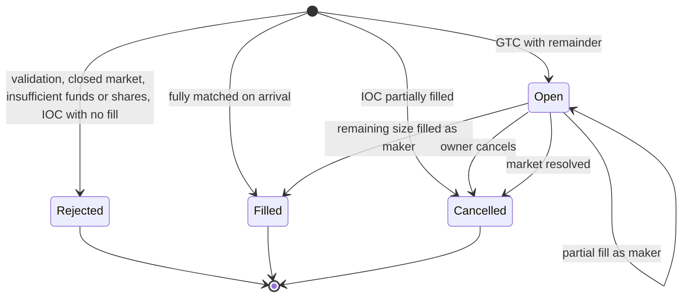
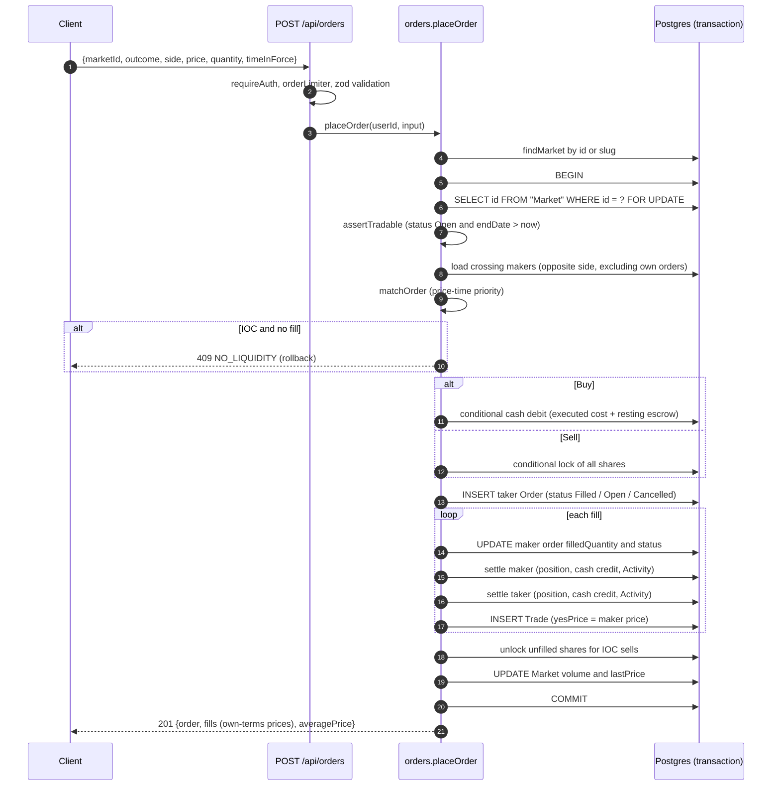

# Core exchange logic

This document specifies how Mirage matches orders, moves money and shares, prices markets and keeps its books consistent. It describes the behaviour of the code as implemented; where the implementation has edge cases worth knowing, they are called out explicitly.

Related documents: [API reference](./api.md) · [Architecture](./architecture.md) · [Roadmap](./plan.md)

Primary sources:

| Concern                                | File                                       |
| -------------------------------------- | ------------------------------------------ |
| Pure matching and settlement math      | `apps/backend/src/engine/matching.ts`      |
| Order placement, cancellation, listing | `apps/backend/src/services/orders.ts`      |
| Cash and share escrow primitives       | `apps/backend/src/services/ledger.ts`      |
| Market row lock and tradability check  | `apps/backend/src/services/market-lock.ts` |
| Pricing, order book, price history     | `apps/backend/src/services/markets.ts`     |
| Split, merge, portfolio valuation      | `apps/backend/src/services/positions.ts`   |
| Daily claim, account balances          | `apps/backend/src/services/users.ts`       |
| Market creation and resolution         | `apps/backend/src/services/admin.ts`       |
| Shared constants and request schemas   | `packages/shared/src/`                     |
| Data model                             | `packages/db/prisma/schema.prisma`         |

---

## 1. Units and constants

| Constant                 | Value                | Meaning                                                                                             |
| ------------------------ | -------------------- | --------------------------------------------------------------------------------------------------- |
| Money unit               | 1 cent               | Every balance, price, amount and volume is an **integer** of cents. There are no floats in storage. |
| `PRICE_MIN`              | `1`                  | Lowest limit price in cents per share.                                                              |
| `PRICE_MAX`              | `99`                 | Highest limit price in cents per share.                                                             |
| `SHARE_PAYOUT_CENTS`     | `100`                | A winning share pays 100¢ ($1.00). A losing share pays 0.                                           |
| `MAX_ORDER_QUANTITY`     | `100000`             | Maximum shares per order, split or merge.                                                           |
| `DAILY_CLAIM_CENTS`      | `10000`              | Default daily reward ($100). Overridable via `DAILY_CLAIM_CENTS` env.                               |
| `STARTING_BALANCE_CENTS` | `1000` (env default) | Cash credited when a user row is first created ($10).                                               |

Displayed probabilities are prices: a YES price of 62¢ means a 62% implied chance.

## 2. Outcomes and shares

Every market is binary with two outcomes, **YES** and **NO**. One YES share plus one NO share of the same market is always worth exactly 100¢, because exactly one of them pays out at resolution. That identity drives everything below:

- **Minting**: 100¢ of cash can be turned into 1 YES + 1 NO (a _pair_).
- **Merging**: 1 YES + 1 NO can be turned back into 100¢.
- A NO share priced at `p` is economically equivalent to the complement of a YES share priced at `100 − p`.

Holdings live in `Position(userId, marketId, outcome)` with:

- `qty` – total shares held, **including** shares escrowed by open sell orders.
- `lockedQty` – shares escrowed by open sell orders. Available shares are `qty − lockedQty`.
- `costBasis` – total cents paid for the shares currently held.

## 3. The unified book (YES terms)

Mirage runs a single central limit order book per market, quoted in YES terms. Each order is stored with its own-terms `price` and a projected `bookSide` and `yesPrice` (`toBook` in the engine):

| Order          | `bookSide` | `yesPrice` | Intuition                            |
| -------------- | ---------- | ---------- | ------------------------------------ |
| Buy YES @ _p_  | `Bid`      | _p_        | Wants YES exposure                   |
| Sell NO @ _p_  | `Bid`      | 100 − _p_  | Giving up NO is gaining YES exposure |
| Sell YES @ _p_ | `Ask`      | _p_        | Giving up YES exposure               |
| Buy NO @ _p_   | `Ask`      | 100 − _p_  | NO exposure is short YES exposure    |

Rule: `bookSide = Bid` when `(outcome = YES) == (side = Buy)`, else `Ask`. Conversion between YES terms and own terms is `toOwnPrice(outcome, x) = outcome == YES ? x : 100 − x` (it is its own inverse).

### 3.1 Crossing, priority and execution price

For an incoming (taker) order with book side `S` and YES price `y`:

- The taker only interacts with resting orders on the **opposite** book side.
- A taker **Bid** crosses asks with `ask.yesPrice ≤ y`. A taker **Ask** crosses bids with `bid.yesPrice ≥ y`.
- **Price-time priority**: asks are consumed lowest `yesPrice` first, bids highest first; ties are broken by oldest `createdAt`, then `id` (database ordering).
- Each fill executes at the **maker's `yesPrice`**. The taker receives any price improvement.
- Fills proceed until the taker is fully filled or no crossing maker remains.

Makers are loaded inside the transaction in batches of 200 (`loadCrossingMakers`) until enough size is found, already filtered by side, `status = Open`, crossing price and `userId ≠ taker`.

### 3.2 Self-trade prevention

Resting orders owned by the taker are **skipped** (they are excluded by the database query and again by `matchOrder`). They stay on the book untouched. Consequence: a user's own GTC remainder can rest at a price that crosses their own opposite-side orders, so the displayed book can appear crossed where only one user sits on both sides.

## 4. Fill types and settlement

Because every order is projected onto one book, four economic cases fall out of a single bid/ask cross:

| Taker/maker pair   | Economic effect                            |
| ------------------ | ------------------------------------------ |
| Buy YES × Sell YES | YES shares transfer seller → buyer         |
| Buy YES × Buy NO   | A new YES/NO pair is **minted**            |
| Sell NO × Sell YES | A YES/NO pair is **merged** back into cash |
| Sell NO × Buy NO   | NO shares transfer seller → buyer          |

Settlement of one fill for one participant (`settleFill`), with `e` = execution YES price, `q` = fill quantity, `own = toOwnPrice(order.outcome, e)`:

| Participant side | Shares                                                                    | Cash credited on the fill                     | Ledger `amount` |
| ---------------- | ------------------------------------------------------------------------- | --------------------------------------------- | --------------- |
| Buy              | `+q` of its outcome, `costBasis += own × q`                               | maker: `(limit − own) × q` refund; taker: `0` | `−own × q`      |
| Sell             | `−q` of its outcome, `lockedQty −= q`, cost basis released proportionally | `own × q`                                     | `+own × q`      |

A maker always executes at its own limit (`own = maker.price`), so the maker refund term evaluates to `0` in practice; the formula exists so the escrow model is explicit. Each participant also receives an `Activity` row (`Buy`/`Sell`) per fill.

### 4.1 Worked examples

All examples use 10 shares. "Upfront" is what happens when the taker order is accepted; "fill" is the settlement.

**A. Transfer YES** – Ann rests _Sell YES @ 60_ (Ask 60). Bob sends _Buy YES @ 65_.

| Step             | Ann (maker, Sell YES)          | Bob (taker, Buy YES)              |
| ---------------- | ------------------------------ | --------------------------------- |
| Ann places order | locks 10 YES (`lockedQty +10`) | –                                 |
| Bob upfront      | –                              | cash −600 (executed cost 60 × 10) |
| Fill at `e = 60` | cash +600, YES −10, locked −10 | YES +10, costBasis +600           |

Bob limited at 65 but paid 60. Volume +600.

**B. Mint a pair** – Ann rests _Buy NO @ 45_ (Ask 55). Bob sends _Buy YES @ 58_.

| Step             | Ann (maker, Buy NO)                 | Bob (taker, Buy YES)    |
| ---------------- | ----------------------------------- | ----------------------- |
| Ann places order | cash −450 (escrow at limit 45 × 10) | –                       |
| Bob upfront      | –                                   | cash −550 (55 × 10)     |
| Fill at `e = 55` | NO +10, costBasis +450, refund 0    | YES +10, costBasis +550 |

Total cash in: 450 + 550 = 1000 = 10 pairs × 100¢. Volume +550 (taker's own price).

**C. Merge a pair** – Ann rests _Sell NO @ 30_ (Bid 70). Bob sends _Sell YES @ 65_ (Ask 65).

| Step             | Ann (maker, Sell NO)       | Bob (taker, Sell YES)       |
| ---------------- | -------------------------- | --------------------------- |
| Ann places order | locks 10 NO                | –                           |
| Bob upfront      | –                          | locks 10 YES                |
| Fill at `e = 70` | cash +300 (own 30), NO −10 | cash +700 (own 70), YES −10 |

1000¢ is released for 10 burned pairs. Bob asked for 65 and received 70.

**D. Transfer NO** – Ann rests _Buy NO @ 40_ (Ask 60). Bob sends _Sell NO @ 35_ (Bid 65).

| Step             | Ann (maker, Buy NO)              | Bob (taker, Sell NO)       |
| ---------------- | -------------------------------- | -------------------------- |
| Ann places order | cash −400 (escrow 40 × 10)       | –                          |
| Bob upfront      | –                                | locks 10 NO                |
| Fill at `e = 60` | NO +10, costBasis +400, refund 0 | cash +400 (own 40), NO −10 |

## 5. Escrow model

| Order side | When accepted                                                                         | While resting                                | On fill                                     | On cancel                                      |
| ---------- | ------------------------------------------------------------------------------------- | -------------------------------------------- | ------------------------------------------- | ---------------------------------------------- |
| Buy        | Taker debit = `Σ(own × q)` over fills **+** `limit × restingQty` (`takerBuyCost`)     | Cash is gone from `usdBalance`               | Shares credited                             | `limit × (quantity − filledQuantity)` refunded |
| Sell       | `lockedQty += quantity` for the **whole** order, only if `qty − lockedQty ≥ quantity` | Shares stay in `qty`, counted in `lockedQty` | `qty −= q`, `lockedQty −= q`, cash credited | `lockedQty −= remaining`                       |

- `restingQty` is `0` for IOC orders, so an IOC buyer is only debited for what executed.
- Cash debits are a single conditional statement: `UPDATE "User" SET "usdBalance" = "usdBalance" − amount WHERE id = … AND "usdBalance" >= amount`. Zero updated rows means `INSUFFICIENT_BALANCE`.
- Share locks are a single conditional statement on `"qty" − "lockedQty" >= quantity`. Zero rows means `INSUFFICIENT_SHARES` (this also fires when the user has no position row).
- `MeDTO.lockedBalance` is computed as `Σ price × (quantity − filledQuantity)` over the user's open **Buy** orders.

## 6. Time in force

| `timeInForce`   | Behaviour                                                                                                                                                                                                                                                                                         |
| --------------- | ------------------------------------------------------------------------------------------------------------------------------------------------------------------------------------------------------------------------------------------------------------------------------------------------- |
| `GTC` (default) | Match what crosses, rest the remainder on the book (`status = Open`).                                                                                                                                                                                                                             |
| `IOC`           | Match what crosses, cancel the remainder. If **nothing** fills, the request fails with `409 NO_LIQUIDITY` and the whole transaction rolls back (no order row is written). A partial IOC is stored with `status = Cancelled` and `filledQuantity > 0`; for sells the unfilled shares are unlocked. |

The web app implements a **market order** as IOC: it walks the visible book to estimate shares and sends the worst price level reached as the limit.

## 7. Order lifecycle



"Rejected" is not persisted; the API returns an error and no row exists. Partial fill is represented by `status = Open` (or `Cancelled`) with `0 < filledQuantity < quantity`.

### 7.1 Cancellation

`DELETE /api/orders/:id` locks the market row, re-reads the order and requires `status = Open` (otherwise `409 ORDER_NOT_OPEN`). `cancelWithRefund` then returns the unfilled escrow (cash for buys, `lockedQty` for sells) and sets `status = Cancelled`. Cancellation is allowed even after the market's `endDate` has passed. Only the owner can cancel; any other user gets `404`.

## 8. Order placement sequence



`averagePrice` in the response is the quantity-weighted own-terms execution price rounded to two decimals, or `null` when nothing filled. Trades written in one transaction receive `createdAt` values one millisecond apart to preserve execution order.

## 9. Split and merge

| Operation | Preconditions                                                                               | Effect                                                                                                   |
| --------- | ------------------------------------------------------------------------------------------- | -------------------------------------------------------------------------------------------------------- |
| Split `q` | Market tradable (`Open` and before `endDate`); cash ≥ `100q`                                | cash −`100q`; YES +`q` and NO +`q`; each side `costBasis += 50q`; `Activity(Split, amount −100q)`        |
| Merge `q` | Market not `Resolved` (allowed after `endDate`); available YES ≥ `q` and available NO ≥ `q` | YES −`q` and NO −`q` with proportional cost-basis release; cash +`100q`; `Activity(Merge, amount +100q)` |

Both run under the market row lock. Merge failing either side returns `INSUFFICIENT_SHARES`.

## 10. Cost basis, average price and P&L

- **Buy fill**: `costBasis += own × q`.
- **Sell fill, merge**: `costBasis −= releasedCostBasis(costBasis, qtyBefore, q)` where the released amount is `round(costBasis × q / qtyBefore)`, or the entire basis when `q ≥ qtyBefore`.
- **Split**: each outcome gains `50¢` of basis per pair.
- **Resolution**: all positions in the market are zeroed (`qty`, `lockedQty`, `costBasis`).

Portfolio valuation (`getPortfolio`, positions with `qty > 0` only):

| Field            | Formula                                                                                       |
| ---------------- | --------------------------------------------------------------------------------------------- |
| `currentPrice`   | implied `yesPrice` for YES, `100 − yesPrice` for NO; `null` when the market has no price      |
| `avgPrice`       | `round(costBasis / qty, 2 decimals)`                                                          |
| `value`          | `currentPrice × qty` (locked shares included); falls back to `costBasis` when price is `null` |
| `pnl`            | `value − costBasis` (unrealized only)                                                         |
| `positionsValue` | `Σ value`                                                                                     |
| `totalValue`     | `cash + lockedCash + positionsValue`                                                          |
| `unrealizedPnl`  | `Σ pnl`                                                                                       |

Realized P&L is not stored separately; it can be reconstructed from the `Activity` ledger.

## 11. Daily claim

`POST /api/me/claim` executes one SQL statement:

```sql
WITH claimed AS (
  UPDATE "User"
  SET "usdBalance" = "usdBalance" + :amount, "lastClaimDate" = :now
  WHERE id = :userId AND ("lastClaimDate" IS NULL OR "lastClaimDate" < :startOfUtcDay)
  RETURNING id
)
INSERT INTO "Activity" (...) SELECT ... 'Claim', :amount ... FROM claimed
```

- The day boundary is **UTC midnight**.
- Concurrent claims serialize on the user row lock and re-evaluate the `WHERE`, so exactly one succeeds. The others receive `409 ALREADY_CLAIMED`.
- `MeDTO.nextClaimAt` is the next UTC midnight when the last claim happened today, otherwise `null` (meaning "claimable now").

## 12. Market lifecycle and resolution

Stored status is `Open` or `Resolved`. The API derives a third state:

| DTO `status` | Condition                           | Orders / split      | Cancel               | Merge               | Resolve             |
| ------------ | ----------------------------------- | ------------------- | -------------------- | ------------------- | ------------------- |
| `open`       | `status = Open` and `endDate > now` | allowed             | allowed              | allowed             | allowed             |
| `closed`     | `status = Open` and `endDate ≤ now` | `409 MARKET_CLOSED` | allowed              | allowed             | allowed             |
| `resolved`   | `status = Resolved`                 | `409 MARKET_CLOSED` | n/a (no open orders) | `409 MARKET_CLOSED` | `409 MARKET_CLOSED` |

Resolution (`POST /api/admin/markets/:id/resolve`, one transaction under the market lock):

1. Require `status = Open` (resolution before `endDate` is permitted).
2. Cancel every open order with a full escrow refund.
3. For each position of the **winning** outcome with `qty > 0`: credit `100 × qty` and write `Activity(Payout, price 100, amount 100 × qty)`.
4. Zero `qty`, `lockedQty` and `costBasis` for **all** positions in the market. Losing positions receive no activity row.
5. Set `status = Resolved`, `resolution`, `resolvedAt`.

## 13. Pricing

### 13.1 Implied YES price

`impliedYesPrice` (`engine/matching.ts`), using the best open bid and ask in YES terms and the market's `lastPrice`:

1. Resolved markets: `100` if YES won, `0` if NO won.
2. If both a bid and an ask exist and `bestAsk − bestBid ≤ 10` (`MIDPOINT_MAX_SPREAD`): `round((bestBid + bestAsk) / 2)`.
3. Otherwise `lastPrice` if any trade has happened.
4. Otherwise the midpoint if both sides exist, else `null`.

`noPrice = 100 − yesPrice` (or `null`). `bestBid` and `bestAsk` come from a single `groupBy` over open orders (`MAX(yesPrice)` of bids, `MIN(yesPrice)` of asks).

### 13.2 24-hour change

`change24h = yesPrice(now) − yesPrice of the most recent trade at or before now − 24h`. It is `null` when no trade exists before that instant or when the stored status is not `Open`. Note that the current value is the implied price (possibly a midpoint) while the reference is a trade price.

### 13.3 Volume and last price

On every placement that produces fills, in the same transaction:

- `Market.volume += Σ (taker own-terms price × q)` – traded notional measured on the taker side.
- `Market.lastPrice = yesPrice` of the last fill.

### 13.4 Price history

`GET /api/markets/:id/prices?interval=` buckets trades by time:

| Interval | Window                                    | Bucket                                                        |
| -------- | ----------------------------------------- | ------------------------------------------------------------- |
| `1d`     | 24 hours                                  | 15 minutes                                                    |
| `1w`     | 7 days                                    | 1 hour                                                        |
| `1m`     | 30 days                                   | 6 hours                                                       |
| `all`    | from `min(market.createdAt, first trade)` | `max(1h, ceil((now − start) / 200 / 1h) × 1h)` (≈ 200 points) |

Algorithm:

1. If a trade exists before the window start, emit a point at the window start with that price (carry-over).
2. For trades in the window, keep the **last** trade price in each bucket; the point time is `max(bucketStart, windowStart)`. A bucket landing exactly on the carry-over timestamp replaces it.
3. If at least one point exists, append a final point at `now` with the market's `lastPrice` (or implied price for resolved markets / markets without trades).

A market with no trades returns an empty array.

## 14. Order book aggregation

`GET /api/markets/:id/orderbook` sums remaining size (`quantity − filledQuantity`) of open orders grouped by `(bookSide, yesPrice)`:

- `yes.bids` – bid levels, highest price first.
- `yes.asks` – ask levels, lowest price first.
- `no.bids` – derived from `yes.asks` with `price = 100 − p` (a YES ask is a NO bid at the complement).
- `no.asks` – derived from `yes.bids` with `price = 100 − p`.

Each side is capped at 50 levels. Levels are aggregated, so individual orders and owners are never exposed.

## 15. Concurrency and integrity

- **Per-market serialization**: order placement, cancellation, split, merge and resolution first run `SELECT id FROM "Market" WHERE id = ? FOR UPDATE`. All book mutations for a market therefore execute one at a time; different markets proceed in parallel.
- **Conditional debits**: cash and share escrow use single-statement conditional updates, so a user trading in two markets concurrently cannot overdraw.
- **Atomicity**: each operation is one interactive Prisma transaction with `maxWait 10s` and `timeout 15s` (`TX_OPTIONS`). Any thrown error rolls back all writes, including partially processed fills.
- **Daily claim** is a single statement and needs no interactive transaction.
- **Maker loading** happens inside the lock, so the book cannot change between matching and settlement.

## 16. Invariants and where they are tested

| Invariant                                                                                                                                                                                   | Test                                                                     |
| ------------------------------------------------------------------------------------------------------------------------------------------------------------------------------------------- | ------------------------------------------------------------------------ |
| `Σ cash + Σ escrowed buy cash + 100 × outstanding pairs` is constant across placements, fills, cancels, splits (claims and payouts excluded)                                                | `apps/backend/tests/matching.test.ts` – 5,000-step randomized simulation |
| YES supply equals NO supply at all times                                                                                                                                                    | same simulation                                                          |
| All four order kinds project correctly; transfer/mint/merge/NO-transfer settle correctly                                                                                                    | `matching.test.ts` unit tests                                            |
| Price-time priority, no match without crossing, self-trade skip                                                                                                                             | `matching.test.ts`                                                       |
| Escrow balances, cancel refunds, double-cancel rejection, IOC no-liquidity and partial IOC, insufficient funds, split/merge, claim once per day, resolution payouts and refunds, pagination | `apps/backend/tests/api.test.ts` (runs when `TEST_DATABASE_URL` is set)  |
| Concurrent daily claims (exactly one succeeds)                                                                                                                                              | `api.test.ts`, enabled with `TEST_CONCURRENCY=1`                         |

## 17. Error codes

All errors use the envelope `{ "error": { "code", "message", "details"? } }`.

| HTTP | `code`                 | Raised when                                                                                                  |
| ---- | ---------------------- | ------------------------------------------------------------------------------------------------------------ |
| 400  | `VALIDATION_ERROR`     | Query/body fails its zod schema (`details` holds flattened field errors); market `endDate` not in the future |
| 400  | `INVALID_JSON`         | Request body is not valid JSON                                                                               |
| 400  | `INSUFFICIENT_BALANCE` | Conditional cash debit affected no rows (buy order, split)                                                   |
| 400  | `INSUFFICIENT_SHARES`  | Not enough unlocked shares to sell or merge                                                                  |
| 401  | `UNAUTHORIZED`         | Missing bearer token, rejected Supabase session, invalid admin key                                           |
| 403  | `FORBIDDEN`            | Verified user has no wallet `address` claim, or the address exceeds 128 characters                           |
| 404  | `NOT_FOUND`            | Unknown market, order (or order owned by another user), route; admin routes when `ADMIN_API_KEY` is unset    |
| 409  | `MARKET_CLOSED`        | Order or split on a non-tradable market; merge or resolve on a resolved market                               |
| 409  | `NO_LIQUIDITY`         | IOC order found nothing to match                                                                             |
| 409  | `ORDER_NOT_OPEN`       | Cancel of an order that is filled or cancelled                                                               |
| 409  | `ALREADY_CLAIMED`      | Daily reward already claimed in the current UTC day                                                          |
| 409  | `CONFLICT`             | Explicit market `slug` already exists                                                                        |
| 413  | `PAYLOAD_TOO_LARGE`    | JSON body over 100 KB                                                                                        |
| 429  | `RATE_LIMITED`         | Global or order rate limit exceeded                                                                          |
| 500  | `INTERNAL`             | Unhandled error (logged with request id; no internals leaked)                                                |

`GET /api/health` is the one exception to the envelope: it returns `503` with `{ "status": "degraded", "db": "error" }` when the database probe fails.
