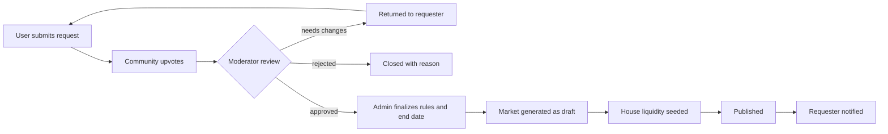
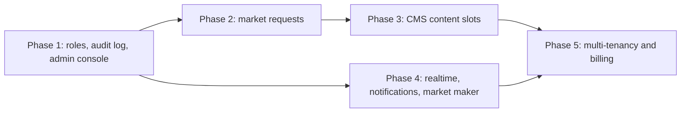

# Product plan and roadmap

> **Status: planned, not implemented.** This document describes where Mirage is going. Everything in the
> [current architecture](./architecture.md), [exchange core](./core.md) and [API](./api.md) is what exists today.
> Items here are proposals to be refined into tickets before they are built.

## Vision

Mirage becomes a **fully customizable prediction-market simulation platform**: a paper-trading exchange where
operators control every piece of content, users propose the markets they want to trade, and organizations can
run their own branded instance. Money stays simulated; the product value is realistic trading mechanics,
engagement, and operator control.

Guiding principles:

- **Everything is data, nothing is hard-coded.** Markets, categories, banners, ads, headlines, the ticker, home
  page sections and even copy are managed from the admin console and rendered through typed content slots.
- **Humans approve, the system automates.** Users propose markets; admins review; the platform generates,
  seeds liquidity, schedules and resolves.
- **Auditability.** Every admin action is logged with actor, before/after state and reason.
- **Keep the core exchange pure.** New features build on top of the existing order book, ledger and escrow
  model described in [core.md](./core.md) and must not weaken its invariants.

## Current baseline

| Area     | Today                                                                                    |
| -------- | ---------------------------------------------------------------------------------------- |
| Markets  | Binary YES/NO markets created and resolved via `x-admin-key` API calls (no UI)           |
| Trading  | Unified CLOB, GTC/IOC orders, escrow, split/merge, resolution payouts                    |
| Users    | Solana wallet sign-in via Supabase, daily $100 reward, portfolio, activity ledger        |
| Content  | Home page layout, ticker, featured market and categories derived automatically from data |
| Realtime | Client polling (order book 4s, trades 8s, lists 30s)                                     |
| Tenancy  | Single tenant                                                                            |

---

## Phase 1: Admin console foundation

**Goal:** operators manage the platform from a UI instead of raw API calls.

### Roles and access control

Replace the shared `ADMIN_API_KEY` with per-user roles.

| Role        | Capabilities                                                                |
| ----------- | --------------------------------------------------------------------------- |
| `user`      | Trade, request markets, comment                                             |
| `moderator` | Review market requests, moderate comments, draft markets                    |
| `admin`     | Publish/resolve/void markets, manage content, adjust balances, manage users |
| `owner`     | Manage admins, tenant settings, billing, destructive operations             |

- Data model: `Role` enum on `User` (or a `Membership` table once multi-tenant), `AuditLog` table
  (`actorId`, `action`, `entityType`, `entityId`, `before`, `after`, `reason`, `ip`, `createdAt`).
- Middleware: `requireRole('admin')` replaces `requireAdmin`; every mutating admin route writes an audit entry
  inside the same transaction.

### Admin application

A separate route tree (`/admin`, lazy-loaded, role-gated) or a dedicated `apps/admin` workspace sharing
`@repo/shared` and the UI kit.

- **Markets:** list with filters, create/edit drafts (title, description, rules, category, image, end date,
  resolution source), schedule publish, close early, resolve with evidence link, **void** (refund all trades at
  cost basis), duplicate.
- **Categories:** create, rename, reorder, icon and colour.
- **Users:** search by wallet, view portfolio and ledger, adjust balance with reason (ledger type
  `Adjustment`), suspend trading, reset account.
- **Liquidity:** configure the house market maker per market (spread, depth, max inventory).
- **Audit log** viewer with diff rendering.
- **Dashboard:** volume, active traders, open interest, markets closing soon, pending requests, pending
  resolutions.

### API additions (sketch)

```
GET    /api/admin/markets?status=draft|scheduled|open|closed|resolved|voided&cursor
POST   /api/admin/markets                 create draft
PATCH  /api/admin/markets/:id             edit draft or metadata
POST   /api/admin/markets/:id/publish     { publishAt? }
POST   /api/admin/markets/:id/resolve     { outcome, evidenceUrl, note }
POST   /api/admin/markets/:id/void        { reason }
GET    /api/admin/users?q&cursor
POST   /api/admin/users/:id/adjust        { amount, reason }
GET    /api/admin/audit?entityType&entityId&cursor
```

**Acceptance:** an admin can take a market from draft to resolution without touching the API directly, and
every step appears in the audit log.

---

## Phase 2: Market request workflow

**Goal:** users decide what gets listed; admins approve and the platform generates the market.



### Request form

- Question (must be binary and objectively resolvable), category, proposed end date, resolution source URL,
  optional context.
- Duplicate detection: fuzzy match against existing markets and open requests before submit.
- Limits: N open requests per user; minimum account age to prevent spam.

### Data model

- `MarketRequest`: `id`, `requesterId`, `title`, `description`, `category`, `proposedEndDate`, `sourceUrl`,
  `status` (`Pending`, `ChangesRequested`, `Approved`, `Rejected`, `Published`), `reviewerId`, `reviewNote`,
  `marketId?`, timestamps.
- `MarketRequestVote`: unique (`requestId`, `userId`).

### Generation step

On approval the system:

1. Normalizes the title and generates a slug.
2. Drafts rules from a template per category (editable by the admin).
3. Creates the market as a draft linked to the request.
4. Seeds liquidity using the house market maker configuration.
5. Publishes on schedule and notifies the requester and voters.

### Engagement

- Public "Requests" board sorted by votes and recency.
- Optional reward for accepted requests (for example a one-time balance credit recorded in the ledger).

**Acceptance:** a user-submitted request can be approved and becomes a tradable market with liquidity, linked
back to the original request.

---

## Phase 3: Customizable content (CMS)

**Goal:** every visible surface of the home page and chrome is configurable without a deploy.

### Content slots

The frontend renders named **slots**; the API returns the active content for each slot.

| Slot               | Content type                                             | Today                      |
| ------------------ | -------------------------------------------------------- | -------------------------- |
| `announcement-bar` | Text + link + tone, dismissible                          | None                       |
| `ticker`           | Source (trending / category / manual list), speed, label | Trending markets by volume |
| `hero`             | Featured market or custom banner                         | Highest-volume market      |
| `headlines`        | Ordered list of market or article links                  | None                       |
| `home-sections`    | Ordered sections (grid, table, carousel) with filters    | Fixed layout               |
| `ad-slot:*`        | Image/HTML-safe creative, link, placement                | None                       |
| `footer-links`     | Link groups                                              | Static                     |

### Data model

- `ContentBlock`: `id`, `slot`, `type`, `payload` (JSON validated by a zod schema per `type`), `priority`,
  `startsAt`, `endsAt`, `audience` (all / signed-in / anonymous / segment), `status` (`Draft`, `Live`,
  `Archived`), `createdBy`, timestamps.
- `ContentRevision` for history and rollback.

### Delivery

- `GET /api/content?slots=ticker,hero,headlines` returns resolved blocks, cached at the edge with short TTL
  and tag-based invalidation on publish.
- Payload schemas live in `@repo/shared` so admin forms and frontend renderers share one contract.
- Ads: impression and click counters (`AdEvent`), frequency capping, no third-party scripts by default so the
  Content-Security-Policy stays strict.

### Admin UX

- Visual slot editor with live preview (desktop, tablet, phone).
- Scheduling calendar, audience targeting, A/B variants (optional, via feature flags).

**Acceptance:** an admin changes the ticker source, adds an announcement bar and schedules a banner, and all
three appear on the live site within a minute without a deploy.

---

## Phase 4: Trading depth and real-time experience

- **Realtime:** WebSocket or SSE channels for order book deltas, trades, prices and user fills; keep polling
  as a fallback. Requires a pub/sub layer (Postgres `LISTEN/NOTIFY` initially, Redis at scale).
- **Order types:** good-til-date expiry, post-only, reduce-only; client-side stop orders converted to limit.
- **Multi-outcome markets:** grouped binary markets ("Who wins?") with a shared event page and
  mutually-exclusive resolution.
- **House market maker:** automated quoting bot per market (configurable spread/depth), running as a worker
  with its own account and inventory limits.
- **Notifications:** fills, market resolution, request status; in-app inbox plus optional email.
- **Social:** comments per market with moderation, watchlists, shareable position cards.
- **Portfolio analytics:** equity curve, realized P&L history, win rate, CSV export.
- **Leaderboards:** by P&L, ROI and accuracy over rolling windows.

---

## Phase 5: Simulation SaaS

**Goal:** organizations run their own branded paper-trading exchange.

### Multi-tenancy

- `Organization` (tenant) with custom domain, theme tokens (colors, logo, fonts), default currency label and
  starting balance rules.
- Every tenant-owned table gains `organizationId`; row-level scoping enforced in the service layer and backed
  by Postgres row-level security.
- `Membership` (`userId`, `organizationId`, `role`) replaces the global role.

### Simulation controls

| Control              | Examples                                             |
| -------------------- | ---------------------------------------------------- |
| Economy              | Starting balance, daily allowance, max position size |
| Seasons/competitions | Start/end, balance reset, prizes, eligibility        |
| Trading rules        | Allowed order types, fees (simulated), trading hours |
| Access               | Public, invite-only, SSO domain restriction          |

### Platform concerns

- **Billing:** plans by active traders and markets (Stripe), usage metering, trials.
- **Onboarding:** tenant creation wizard, template markets per industry (education, internal forecasting,
  communities).
- **Data export:** CSV/Parquet exports and a read-only reporting API.
- **Compliance:** clear "no real money" positioning, data retention settings, GDPR tooling (export and
  delete account).

---

## Cross-cutting engineering work

| Topic           | Plan                                                                                                                                               |
| --------------- | -------------------------------------------------------------------------------------------------------------------------------------------------- |
| Background jobs | Queue (BullMQ or Postgres-based) for auto-close at `endDate`, scheduled publish, resolution reminders, liquidity bot, notifications                |
| Caching         | Redis for rate limits, hot market summaries and content slots                                                                                      |
| Observability   | Sentry for errors (hook into the existing error boundaries and API error handler), OpenTelemetry traces, structured logs already in place via pino |
| API contract    | Generate an OpenAPI spec from the zod schemas in `@repo/shared`; typed client for admin app                                                        |
| Testing         | Playwright end-to-end suites for trading, admin and request flows; load tests for matching                                                         |
| Security        | Per-route role checks, audit log, CSRF-safe admin actions, stricter CSP with nonces if any inline content is introduced                            |
| Data            | Soft deletes for content, migrations reviewed for zero-downtime, nightly backups and restore drills                                                |

## Suggested sequencing



Phases 2 and 4 can run in parallel once Phase 1 lands. Estimate each phase after Phase 1 is scoped in detail.

## Open questions

1. Admin console as a route tree in `apps/frontend` or a separate `apps/admin` deployment?
2. Should rejected market requests be public (transparency) or private to the requester?
3. Resolution disputes: admin-only, or a community challenge window before payout?
4. Ads: first-party creatives only, or allow an ad network (impacts CSP and privacy policy)?
5. Tenancy model: shared database with row-level security, or database-per-tenant for enterprise plans?
